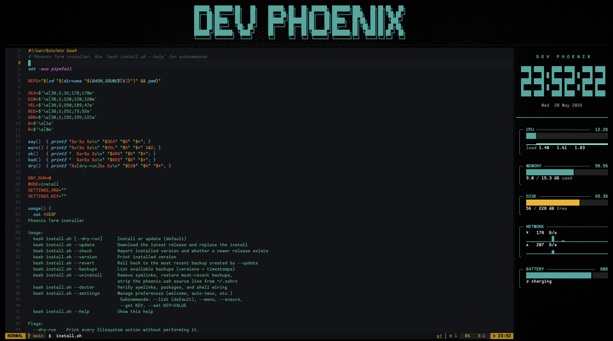

# Phoenix Term

A complete, opinionated terminal stack for **macOS and Debian/Ubuntu Linux** — Ghostty + tmux + Starship + LazyVim — with a live system-monitor sidebar, a welcome banner, per-command divider rules, and a cohesive LightSeaGreen + Phoenix color theme across every layer.

One command installs everything: terminal, font, shell plugins, editor, sidebar, and ~18 modern CLI tools.



---

## Table of contents

- [What's inside](#whats-inside)
- [Install](#install)
- [First run — what you'll see](#first-run--what-youll-see)
- [Daily commands cheatsheet](#daily-commands-cheatsheet)
- [Keyboard shortcuts](#keyboard-shortcuts)
- [The tools, one-by-one](#the-tools-one-by-one)
- [Customize](#customize)
- [`phoenix-term` CLI](#phoenix-term-cli)
- [Update](#update)
- [Revert (roll back an update)](#revert-roll-back-an-update)
- [Doctor (healthcheck)](#doctor-healthcheck)
- [Uninstall](#uninstall)
- [Troubleshooting](#troubleshooting)
- [Repo layout](#repo-layout)
- [Requirements](#requirements)

---

## What's inside

| Layer                | Component                                                              |
| -------------------- | ---------------------------------------------------------------------- |
| Terminal             | Ghostty (Phoenix wallpaper, LightSeaGreen text, ComicShannsMono font)  |
| Shell                | zsh + Oh-My-Zsh + zsh-autosuggestions + fast-syntax-highlight          |
| Prompt               | Starship with Warp-style rounded pills                                 |
| Multiplexer          | tmux (TPM + tmux-resurrect + tmux-continuum, auto-launches per window) |
| Sidebar              | `phoenix-sysmon` — CPU / memory / disk / network / battery + clock     |
| Welcome              | Per-shell figlet banner ("ANSI Shadow"), optionally pinned as a pane   |
| Editor               | Neovim + LazyVim with the `phoenix` Black-and-Gold colorscheme         |
| Fuzzy / nav / search | fzf · zoxide · fd · ripgrep · eza · bat · atuin · yazi · btop          |
| Git                  | lazygit (TUI) · gh (GitHub CLI) · git aliases                          |
| Docker               | lazydocker (TUI for containers / images / volumes / logs)              |
| Help                 | tldr (community man-page summaries)                                    |
| Clipboard            | `phoenix-clip` — pbcopy on macOS, wl-copy / xclip on Linux             |

---

## Install

**One command, both OSes:**

```sh
curl -fsSL https://raw.githubusercontent.com/DevGeekPhoenix/phoenix-term/main/bootstrap.sh | bash
```

The bootstrap script resolves the latest GitHub Release, downloads its source tarball, unpacks it to `~/.phoenix-term`, and runs `install.sh` end-to-end. Re-running this same one-liner upgrades to the newest release (your existing install is backed up to `~/.phoenix-term.bak-<timestamp>`).

### macOS

That's it. You'll click through **two macOS dialogs** mid-install: the Xcode Command Line Tools prompt (triggered by Homebrew) and Gatekeeper on first Ghostty launch. Everything else is hands-off.

### Linux (Debian/Ubuntu and derivatives)

Supported: **Ubuntu, Debian, Mint, Pop!\_OS, Kali, elementary, Zorin, Raspbian**. Architectures: **x86_64, aarch64**.

If you're on a fresh box without `curl` yet:

```sh
sudo apt update && sudo apt install -y curl
```

Then run the one-liner above. The installer will `sudo` once to install apt packages; the rest stays in your home directory. **Ghostty** is best-effort on Linux — if `snap` isn't available the installer prints a warning with a manual download link.

### Pin a specific release

```sh
PHOENIX_TAG=v0.1.0 \
  bash -c "$(curl -fsSL https://raw.githubusercontent.com/DevGeekPhoenix/phoenix-term/main/bootstrap.sh)"
```

### For developers (clone-based install)

If you plan to hack on Phoenix Term itself, clone the repo so your edits are live:

```sh
git clone https://github.com/DevGeekPhoenix/phoenix-term.git
cd phoenix-term
bash install.sh
```

In a git clone, `phoenix-term update` refuses to run (it would overwrite your working tree). Use `git pull` to update; everything in the repo is symlinked into `~/`, so the change is live as soon as you reload the relevant tool.

### What the installer does (both OSes)

1. Detects your OS/distro (`detect_os` — fails fast on unsupported distros)
2. Installs the package manager if needed (Homebrew on macOS) and every CLI tool above
3. Installs Ghostty + ComicShannsMono Nerd Font
4. Installs Oh-My-Zsh + the `zsh-completions` plugin
5. Installs TPM (tmux plugin manager) and bootstraps tmux plugins
6. Bootstraps LazyVim starter into `~/.config/nvim`
7. Copies the `ANSI_Shadow.flf` figlet font into your `figlet` install
8. Symlinks every config (backing up any existing file as `<path>.bak-<timestamp>`)
9. Appends one `source <repo>/shell/phoenix.zsh` line to your `~/.zshrc`
10. Writes default preferences to `~/.config/phoenix-term/config.zsh`
11. On first install, offers to drop you into the interactive settings menu

**Re-running `bash install.sh` is always safe** — every step is idempotent.

---

## First run — what you'll see

Open a new Ghostty window (or run `exec zsh`). You'll get:

- A figlet **welcome banner** with your name in big block letters, centered
- A **34-column system-monitor sidebar** pinned to the right (live clock, CPU, memory, disk, network, battery)
- A new **tmux session** automatically (one per Ghostty window — destroyed on close)
- A **full-width divider line** above every prompt to separate command outputs
- A **Starship prompt** with rounded pills showing your directory, git status, and exit code

---

## Daily commands cheatsheet

These are the commands you'll use most. All of them are zsh aliases set up by `shell/phoenix.zsh`.

### Listing files

| Command | What it does                                     |
| ------- | ------------------------------------------------ |
| `ls`    | List files with icons (`eza --icons`)            |
| `l`     | Long listing with icons                          |
| `ll`    | Long listing including hidden files + git status |
| `lt`    | Tree view, 2 levels deep                         |
| `ltt`   | Tree view, 3 levels deep                         |

### Navigating

| Command      | What it does                                      |
| ------------ | ------------------------------------------------- |
| `cd <dir>`   | Smart cd via zoxide — also remembers your history |
| `cd <fuzzy>` | `cd phx` jumps to any directory containing "phx"  |
| `cd -`       | Go back to the previous directory                 |
| `..`         | Go up one level                                   |
| `...`        | Go up two levels                                  |
| `....`       | Go up three levels                                |
| `zi`         | Interactive directory picker (fzf-style)          |
| `z <fuzzy>`  | Same as `cd <fuzzy>` (zoxide's native name)       |

### Files

| Command          | What it does                                       |
| ---------------- | -------------------------------------------------- |
| `cat <file>`     | Syntax-highlighted view (`bat`)                    |
| `find <pattern>` | Fast `fd` search (replaces GNU find)               |
| `rg <pattern>`   | Fast in-file search (ripgrep)                      |
| `y`              | Open yazi file manager — cd's to wherever you exit |

### Git

| Command     | What it does                                    |
| ----------- | ----------------------------------------------- |
| `g`         | `git`                                           |
| `gst`       | `git status`                                    |
| `gco <ref>` | `git checkout`                                  |
| `gp`        | `git push`                                      |
| `gl`        | `git pull`                                      |
| `gcm "msg"` | `git commit -m "msg"`                           |
| `lg`        | Open **lazygit** — full-screen git TUI          |
| `ld`        | Open **lazydocker** — full-screen docker TUI    |
| `gh`        | GitHub CLI (`gh pr create`, `gh issue list`, …) |

### Tmux

| Command     | What it does                   |
| ----------- | ------------------------------ |
| `ta <name>` | Attach to a tmux session       |
| `tn <name>` | Start a new named tmux session |
| `tl`        | List existing tmux sessions    |
| `tk <name>` | Kill a tmux session            |

### History & search

| Command  | What it does                                         |
| -------- | ---------------------------------------------------- |
| `Ctrl-R` | **atuin** fuzzy search across all your shell history |
| `Ctrl-T` | **fzf** picker for any file under cwd                |
| `Alt-C`  | **fzf** picker for any directory under cwd           |

### Editor

| Command       | What it does             |
| ------------- | ------------------------ |
| `nvim <file>` | Open in Neovim (LazyVim) |
| `vi <file>`   | Aliased to `nvim`        |
| `vim <file>`  | Aliased to `nvim`        |

### System monitor

| Command | What it does                                |
| ------- | ------------------------------------------- |
| `top`   | Open **btop** — interactive process monitor |

### Help

| Command      | What it does                                 |
| ------------ | -------------------------------------------- |
| `tldr <cmd>` | Community man-page summary with examples     |
| `man <cmd>`  | Real man pages — rendered with `bat` styling |

---

## Keyboard shortcuts

### Ghostty (terminal window)

| Shortcut          | Action                            |
| ----------------- | --------------------------------- |
| `Cmd-T`           | New tab (new tmux session)        |
| `Cmd-D`           | Split right within Ghostty        |
| `Cmd-Shift-D`     | Split down within Ghostty         |
| `Cmd-W`           | Close current pane/tab            |
| `Cmd-Shift-Enter` | Toggle fullscreen                 |
| `Cmd-Alt-←/→/↑/↓` | Move focus between Ghostty splits |
| `Cmd-K`           | Clear screen                      |

> On Linux replace `Cmd` with whatever Super/Meta key your DE uses (Ghostty's defaults work on Linux too, but your window manager may shadow some bindings).

### Tmux — prefix is `Ctrl-A`

To send any tmux command, hit `Ctrl-A` first, **release**, then the next key.

| Shortcut         | Action                                             |
| ---------------- | -------------------------------------------------- |
| `Ctrl-A S`       | **Toggle the system-monitor sidebar**              |
| `Ctrl-A \|`      | Split pane right                                   |
| `Ctrl-A -`       | Split pane down                                    |
| `Ctrl-A c`       | New tmux window                                    |
| `Ctrl-A h/j/k/l` | Move between panes (vim-style)                     |
| `Ctrl-A H/J/K/L` | Resize current pane                                |
| `Ctrl-A r`       | Reload tmux config                                 |
| `Ctrl-A [`       | Enter copy-mode (scroll + select)                  |
| `Ctrl-A d`       | Detach from session (session keeps running)        |
| Mouse drag       | Selects in copy-mode (mouse mode is on by default) |

### Copy mode (after `Ctrl-A [`)

| Shortcut | Action                                                             |
| -------- | ------------------------------------------------------------------ |
| `v`      | Start selection (vi keys)                                          |
| `y`      | Copy selection to **system clipboard** (`phoenix-clip` handles it) |
| `q`      | Quit copy mode                                                     |
| `/` `?`  | Search forward / backward                                          |

### Neovim / LazyVim

LazyVim provides hundreds of bindings; these are the ones you'll touch first:

| Shortcut    | Action                              |
| ----------- | ----------------------------------- |
| `Space`     | Leader key — opens the LazyVim menu |
| `Space f f` | Find file (fzf)                     |
| `Space f g` | Live grep across the project        |
| `Space e`   | Toggle the file-tree sidebar        |
| `Space g g` | Open lazygit inside nvim            |
| `Space l`   | Open the Lazy plugin manager        |
| `Space q q` | Quit                                |
| `:Mason`    | Manage LSPs, formatters, linters    |

The Phoenix Black-and-Gold colorscheme is set automatically. To browse all LazyVim keymaps: `Space s k`.

---

## The tools, one-by-one

Quick reference so you know what each tool is for. The shell aliases in the [cheatsheet](#daily-commands-cheatsheet) cover the most common usage.

| Tool           | What it is                                 | First command to try               |
| -------------- | ------------------------------------------ | ---------------------------------- |
| **starship**   | Cross-shell prompt (the rounded pills)     | already on every prompt            |
| **fzf**        | General-purpose fuzzy finder               | `Ctrl-R`, `Ctrl-T`, `Alt-C`        |
| **zoxide**     | Smarter `cd` — remembers your directories  | `cd <fragment>`, `zi`              |
| **atuin**      | Searchable, sync-able shell history        | `Ctrl-R`, then `atuin import auto` |
| **eza**        | Modern `ls` with icons + git column        | `ls`, `ll`, `lt`                   |
| **bat**        | Syntax-highlighted `cat`                   | `cat <file>`                       |
| **fd**         | Fast, intuitive `find`                     | `find <pattern>`                   |
| **ripgrep**    | Fast in-file search                        | `rg <pattern>`                     |
| **lazygit**    | Full-screen git TUI                        | `lg`                               |
| **lazydocker** | Full-screen docker TUI (containers/logs/…) | `ld`                               |
| **gh**         | GitHub CLI                                 | `gh auth login`, `gh pr create`    |
| **yazi**       | TUI file manager — cd's where you exit     | `y`                                |
| **btop**       | Beautiful process monitor                  | `top`                              |
| **tldr**       | Community man-page summaries               | `tldr tar`                         |
| **figlet**     | ASCII-art text                             | `figlet -f ANSI_Shadow "HELLO"`    |
| **neovim**     | Modal editor — paired with LazyVim distro  | `nvim`                             |

**One-time setup recommended:**

```sh
gh auth login              # Lets `gh` and lazygit talk to GitHub
atuin import auto          # Pulls in your existing shell history
```

---

## Customize

Phoenix has two layers of config:

1. **Persistent preferences** — `~/.config/phoenix-term/config.zsh`, managed via `phoenix-term settings`
2. **Per-shell overrides** — export an env var in `~/.zshrc` _before_ the phoenix source line

### Available settings

| Key                     | Type | Default       | Effect                                                       |
| ----------------------- | ---- | ------------- | ------------------------------------------------------------ |
| `PHOENIX_NAME`          | text | `DEV PHOENIX` | Name on the welcome banner and sysmon title                  |
| `PHOENIX_BANNER_STICKY` | enum | `sticky`      | `sticky` (pane), `inline` (per shell), or `off`              |
| `PHOENIX_BG`            | path | `phoenix`     | Ghostty background image — path or `phoenix` for the default |
| `PHOENIX_BG_MODE`       | enum | `image`       | `image` (wallpaper) or `color` (solid background)            |
| `PHOENIX_BG_COLOR`      | text | `#0c0f11`     | Background color when `BG_MODE=color`                        |
| `PHOENIX_NVIM_DEFAULT`  | bool | `1`           | Make `nvim` the default `$EDITOR` (also aliases `vi`/`vim`)  |

### Set them interactively

```sh
phoenix-term settings           # Drops into the numbered menu
```

### Or from the command line

```sh
phoenix-term settings --list
phoenix-term settings --get PHOENIX_NAME
phoenix-term settings --set PHOENIX_NAME="My Name"
phoenix-term settings --set PHOENIX_BG_MODE=color
phoenix-term settings --set PHOENIX_BG_COLOR=#1a1a2e
```

### Use your own wallpaper

Drop any JPG into the repo and point at it:

```sh
phoenix-term settings --set PHOENIX_BG=~/Pictures/my-wallpaper.jpg
```

To re-darken an image so colors stay readable on top (the bundled wallpaper is pre-darkened to ~30 %):

```sh
python3 -c "from PIL import Image, ImageEnhance; \
  i=Image.open('original.jpg').convert('RGB'); \
  ImageEnhance.Brightness(i).enhance(0.30).save('phoenix-bg.jpg','JPEG',quality=92)"
```

After any setting change, reload Ghostty (close + reopen, or `Cmd-,` then save) for image/color changes; shell-side changes apply on the next `exec zsh`.

---

## `phoenix-term` CLI

The everyday wrapper that ships with the install.

```
phoenix-term install        Run or refresh the installer (idempotent)
phoenix-term update         Fast-forward to the latest release tag and re-link
phoenix-term check          Fetch tags and report if a newer release exists
phoenix-term doctor         Healthcheck symlinks, packages, shell wiring
phoenix-term version        Show the release tag this clone is on
phoenix-term settings       Interactive preferences menu
  phoenix-term settings --list             Print current values
  phoenix-term settings --get KEY          Print one value
  phoenix-term settings --set KEY=VALUE    Set one value
phoenix-term uninstall      Remove symlinks, restore most-recent backups
phoenix-term where          Print the repo path
phoenix-term help           Show this help
```

Flags after the subcommand pass through to `install.sh`, so `phoenix-term install --dry-run` works.

---

## Update

Phoenix Term notifies you when a new **GitHub Release** is published (e.g. `v0.2.0`). At most once a day, a fresh interactive shell shows:

```
▲ Phoenix Term: v0.1.0 → v0.2.0 — run phoenix-term update
```

The check resolves `github.com/DevGeekPhoenix/phoenix-term/releases/latest` in the background — no API auth required.

```sh
phoenix-term check          # Re-resolve the latest release right now
phoenix-term update         # Download its tarball, replace install, re-run installer
```

`phoenix-term update`:

1. Resolves the latest release tag via the redirect on `/releases/latest`
2. Downloads `https://github.com/DevGeekPhoenix/phoenix-term/archive/refs/tags/<tag>.tar.gz`
3. Moves your existing `~/.phoenix-term` to `~/.phoenix-term.bak-<timestamp>` (kept indefinitely — see [Revert](#revert-roll-back-an-update))
4. Extracts the new release in place
5. Writes the new tag to `~/.phoenix-term/.version`
6. Re-execs `install.sh` so any new symlinks or packages get added

### Your settings survive every update

`~/.config/phoenix-term/config.zsh` — written by `phoenix-term settings` — lives **outside** the install dir. The update only touches `~/.phoenix-term`, so every preference you set (`PHOENIX_NAME`, banner mode, background image/color, …) carries forward unchanged. After an update finishes you'll see:

```
• user settings preserved → /home/you/.config/phoenix-term/config.zsh
```

If a new release adds a setting key, it appears in `phoenix-term settings --list` with its default value — your existing keys are never reset.

> **Dev clones:** if `~/.phoenix-term` (or wherever you installed) is a `git clone`, `phoenix-term update` refuses — use `git pull` instead.

---

## Revert (roll back an update)

Every `phoenix-term update` keeps the previous install at `~/.phoenix-term.bak-<timestamp>`. You can roll back with **one command**, same on macOS and Linux:

```sh
phoenix-term revert            # or: phoenix-term rollback
```

What it does:

1. Picks the most recent `~/.phoenix-term.bak-*` directory
2. Rotates the **current** `~/.phoenix-term` to a fresh `.bak-<now>` snapshot
3. Moves the chosen backup into `~/.phoenix-term`
4. Re-execs `install.sh` to refresh all symlinks against the restored files

Because step 2 saves the "current" state, **a revert is itself revertable** — running `phoenix-term revert` again rolls forward to the state you just left.

### See what's available to roll back to

```sh
phoenix-term backups           # or: phoenix-term list-backups
```

Sample output:

```
Phoenix Term — backups  (/Users/you/.phoenix-term.bak-*)

  #     VERSION         DATE                 PATH
  ────  ──────────────  ───────────────────  ────
  1     v0.2.0          2026-05-17 14:22:09  ~/.phoenix-term.bak-20260517142209
  2     v0.1.0          2026-05-15 09:08:41  ~/.phoenix-term.bak-20260515090841

  Roll back to the most recent: phoenix-term revert
```

### Your settings survive every revert too

Same guarantee as updates: `~/.config/phoenix-term/config.zsh` lives outside the install dir, so rolling back to an older release doesn't undo your customizations. After a revert finishes you'll see:

```
• user settings preserved → /home/you/.config/phoenix-term/config.zsh
```

If you want to also reset a specific setting to its default while reverting, that's a separate `phoenix-term settings --set KEY=...` step.

### Notes

- Backups are **never auto-pruned**. If they pile up, delete the ones you don't need: `rm -rf ~/.phoenix-term.bak-<timestamp>`.
- `phoenix-term revert` refuses on `git clone` installs — use `git reset` / `git checkout` instead.
- The revert preserves your **personal config** (`~/.config/phoenix-term/config.zsh`) — only the install dir gets swapped.

---

## Doctor (healthcheck)

```sh
phoenix-term doctor
```

Reports the OS+arch it detected, then verifies:

- Every symlink points at the right place in this repo
- Every package is installed (per-OS: brew formulas/casks on macOS, apt packages + Linux extras on Debian)
- `~/.zshrc` sources `phoenix.zsh` from **this** repo path (warns if it points at a different clone)
- The figlet `ANSI_Shadow.flf` font is in place
- `python3`, `nvim` are on `$PATH` and `~/.config/nvim/init.lua` exists (LazyVim)
- (Linux only) `phoenix-clip` is present and the Nerd Font landed in `~/.local/share/fonts/`

Exits non-zero if anything's wrong, so you can wire it into CI or a heartbeat.

---

## Uninstall

```sh
phoenix-term uninstall
```

What it does:

- Removes every Phoenix-owned symlink under `~/.config/`, `~/.tmux.conf`, `~/.local/bin/phoenix-*`
- Restores the most-recent `.bak-<timestamp>` for each
- Strips the `source <repo>/shell/phoenix.zsh` line out of `~/.zshrc`
- **Leaves the repo, brew packages, apt packages, Oh-My-Zsh, LazyVim, and your `~/.config/phoenix-term/config.zsh` alone** — uninstall is a config rollback, not a system wipe.

If you want to remove the installed tools too: `brew uninstall <pkg>` on macOS, `sudo apt remove <pkg>` on Linux.

---

## Troubleshooting

### "preflight failed — fix the issues above"

`install.sh` runs a set of pre-flight checks before touching anything (curl, tar, network, disk space, plus `sudo` + `apt` lock on Linux, plus "not running as root" on macOS). If you see a ✗, the line right below it tells you exactly what to do — fix it, then re-run.

Common ones:

| Failure                      | Fix                                                                                                     |
| ---------------------------- | ------------------------------------------------------------------------------------------------------- |
| `curl missing` on Linux      | `sudo apt update && sudo apt install -y curl`                                                           |
| `github.com unreachable`     | Check network / proxy / DNS — the installer needs github.com                                            |
| `disk space: only XXMb free` | Free up ≥ 1 GB in `$HOME`                                                                               |
| `running as root` (macOS)    | Exit and re-run as your regular user — Homebrew refuses root                                            |
| `sudo missing` (Linux)       | `su -c 'apt install -y sudo && usermod -aG sudo $USER'` then start a new shell                          |
| `apt lock held`              | Wait 5 min for cloud-init / unattended-upgrades to finish, or `sudo systemctl stop unattended-upgrades` |

### "command not found" after install

Open a fresh shell (`exec zsh`), or open a new Ghostty window. The aliases live in `phoenix.zsh`, which only loads in zsh.

### Sidebar isn't showing

```sh
phoenix-term doctor             # Verifies the symlinks
echo $TMUX                      # If empty, you're not in tmux yet
```

Inside tmux, hit `Ctrl-A S` to toggle the sidebar.

### Welcome banner is too tall / I don't want it

```sh
phoenix-term settings --set PHOENIX_BANNER_STICKY=off
```

### Sidebar doesn't update on Linux

Sysmon reads `/proc` and `/sys` directly on Linux. Permission errors are rare but possible on hardened systems — re-run `phoenix-term doctor` and look for missing tools.

### Ghostty didn't install on Linux

The installer tries `snap install ghostty --classic`. If snap isn't on your system, install Ghostty manually from <https://ghostty.org/download> then re-run `bash install.sh`. Everything else (font, tmux, zsh, sidebar, sysmon) works in any truecolor terminal — Alacritty, Kitty, foot, GNOME Terminal — so you can use Phoenix without Ghostty.

### Font looks wrong / missing icons

You need to tell your terminal to use `ComicShannsMono Nerd Font Mono`. Ghostty is set up automatically. Other terminals: set it in their preferences. Confirm the font installed with `fc-list | grep -i comicshann` (Linux) or `system_profiler SPFontsDataType | grep -i comicshann` (macOS).

### Tmux still has macOS clipboard quirks

`phoenix-clip` auto-detects: pbcopy on macOS, wl-copy on Wayland, xclip → xsel on X11. If your distro doesn't have any of them, install one: `sudo apt install xclip` (X11) or `sudo apt install wl-clipboard` (Wayland) — actually `bash install.sh` already does this.

---

## Repo layout

```
phoenix-term/
├── install.sh                       one-shot installer (idempotent, cross-platform)
├── README.md
├── CLAUDE.md                        agent guide / conventions
├── ghostty/
│   ├── phoenix.config               → ~/.config/ghostty/config
│   └── phoenix-bg.jpg               → ~/.config/ghostty/phoenix-bg.jpg
├── starship/
│   └── phoenix.toml                 → ~/.config/starship.toml
├── tmux/
│   └── phoenix.conf                 → ~/.tmux.conf
├── nvim/
│   ├── colors/phoenix.lua           → ~/.config/nvim/colors/phoenix.lua
│   ├── lua/plugins/colorscheme.lua  → ~/.config/nvim/lua/plugins/colorscheme.lua
│   └── lua/lualine/themes/phoenix.lua
├── shell/
│   └── phoenix.zsh                  sourced from ~/.zshrc
├── bin/
│   ├── phoenix-term                 → ~/.local/bin/phoenix-term         (everyday CLI)
│   ├── phoenix-sysmon               → ~/.local/bin/phoenix-sysmon       (sidebar dashboard)
│   ├── phoenix-sysmon-toggle        → ~/.local/bin/phoenix-sysmon-toggle
│   ├── phoenix-banner               → ~/.local/bin/phoenix-banner       (sticky banner pane)
│   ├── phoenix-tmux-init             → ~/.local/bin/phoenix-tmux-init
│   ├── phoenix-tmux-rebalance       → ~/.local/bin/phoenix-tmux-rebalance
│   └── phoenix-clip                 → ~/.local/bin/phoenix-clip         (cross-platform clipboard)
└── fonts/
    └── ANSI_Shadow.flf              welcome-banner figlet font
```

Edit any file in this repo and reload the relevant tool — every config in `~/` is a symlink back here.

---

## Requirements

- **macOS** (Apple Silicon or Intel) **or** **Debian/Ubuntu Linux** (x86_64 or aarch64)
- **Internet** — the installer pulls Homebrew/apt packages, Oh-My-Zsh, TPM, LazyVim, fonts, plus official install scripts for several tools
- **`git` + `curl`** — already on macOS (via Xcode CLT, triggered by Homebrew); on Linux: `sudo apt install git curl`
- **`sudo` access** (Linux only — for `apt install` and `/opt/nvim*`)

---

## License

MIT.
