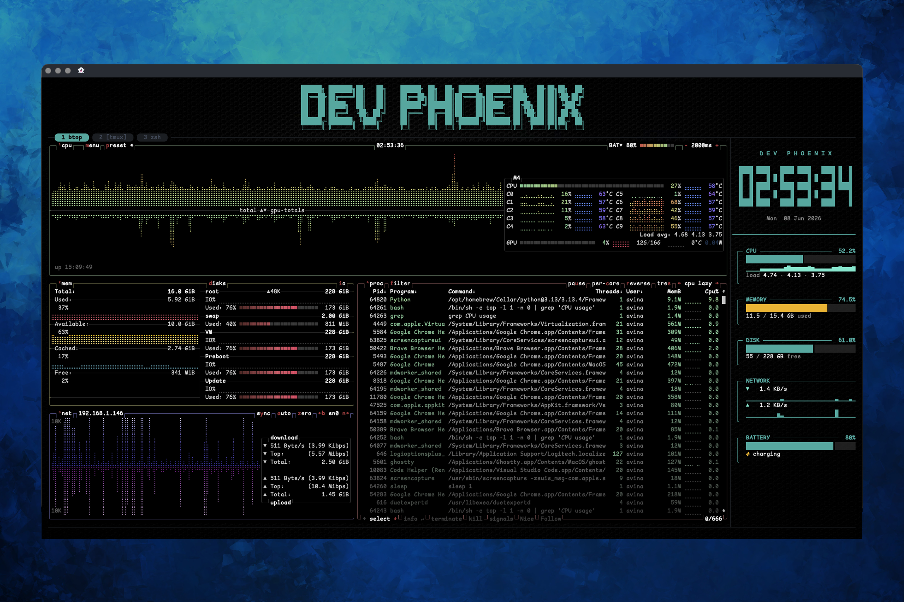

# Phoenix Term

A complete, opinionated terminal stack for **macOS, Debian/Ubuntu, Fedora, and Arch Linux** — Ghostty + tmux + Starship + LazyVim — with a live system-monitor sidebar, a welcome banner, per-command divider rules, and a cohesive LightSeaGreen + Phoenix color theme across every layer.

One command installs everything: terminal, font, shell plugins, editor, sidebar, and ~18 modern CLI tools.



---

## Table of contents

- [What's inside](#whats-inside)
- [Install](#install)
- [First run — what you'll see](#first-run--what-youll-see)
- [Daily commands cheatsheet](#daily-commands-cheatsheet)
- [Keyboard shortcuts](#keyboard-shortcuts)
- [The tools, one-by-one](#the-tools-one-by-one)
- [Customize](#customize)
- [`phoenix-term` CLI](#phoenix-term-cli)
- [Update](#update)
- [Revert (roll back an update)](#revert-roll-back-an-update)
- [Doctor (healthcheck)](#doctor-healthcheck)
- [Uninstall](#uninstall)
- [Troubleshooting](#troubleshooting)
- [Repo layout](#repo-layout)
- [Requirements](#requirements)

---

## What's inside

| Layer                | Component                                                              |
| -------------------- | ---------------------------------------------------------------------- |
| Terminal             | Ghostty (Phoenix wallpaper, LightSeaGreen text, ComicShannsMono font)  |
| Shell                | zsh + Oh-My-Zsh + zsh-autosuggestions + fast-syntax-highlight          |
| Prompt               | Starship with Warp-style rounded pills                                 |
| Multiplexer          | tmux (TPM + tmux-resurrect + tmux-continuum + extrakto + tmux-open + tmux-cowboy) — Ghostty tabs are tmux windows; each Ghostty window is its own session |
| Sidebar              | `phoenix-sysmon` — CPU / memory / disk / network / battery + clock     |
| Welcome              | Per-shell figlet banner ("ANSI Shadow"), optionally pinned as a pane   |
| Editor               | Neovim + LazyVim with the `phoenix` Black-and-Gold colorscheme         |
| Fuzzy / nav / search | fzf · zoxide · fd · ripgrep · eza · bat · atuin · yazi · btop          |
| Git                  | lazygit (TUI) · gh (GitHub CLI) · git aliases                          |
| Docker               | lazydocker (TUI for containers / images / volumes / logs)              |
| Help                 | tldr (community man-page summaries)                                    |
| Cheat sheet          | `phoenix-cheat` — tabbed popup of every shortcut, alias, and command   |
| Clipboard            | `phoenix-clip` — pbcopy on macOS, wl-copy / xclip on Linux             |
| Browser launcher     | `web` — saved-links popup, localhost dev-server picker, or open any URL |
| SSH host manager     | `phxssh` — lazyssh TUI over `~/.ssh/config` (connect · add · edit · search · pin) |
| Release notes        | `phoenix-term notes` — what's-new popup, shown automatically after updates |

---

## Install

**One command, both OSes:**

```sh
curl -fsSL https://raw.githubusercontent.com/DevGeekPhoenix/phoenix-term/main/bootstrap.sh | bash
```

It resolves the latest GitHub Release, unpacks it to `~/.phoenix-term`, and runs `install.sh`. Re-running the same one-liner upgrades (the old install is kept at `~/.phoenix-term.bak-<timestamp>`).

### macOS

That's it. You'll click through two dialogs mid-install: the Xcode Command Line Tools prompt (triggered by Homebrew) and Gatekeeper on first Ghostty launch.

### Linux (Debian/Ubuntu and derivatives)

Supported: **Ubuntu, Debian, Mint, Pop!\_OS, Kali, elementary, Zorin, Raspbian** on **x86_64 / aarch64**. On a fresh box: `sudo apt update && sudo apt install -y curl` first. The installer `sudo`s once for apt packages; the rest stays in your home. Ghostty installs via the mkasberg `.deb` (snap fallback) — best-effort, with a manual link printed if both fail.

### Linux (Fedora and derivatives)

Supported: **Fedora, Nobara, Ultramarine, Bazzite** on **x86_64 / aarch64**. On a fresh box: `sudo dnf install -y curl` first. The installer `sudo`s once for dnf packages; the rest stays in your home. Ghostty installs from the `scottames/ghostty` COPR — best-effort, with a manual link printed if it fails. (RHEL/Rocky/Alma are not supported — package availability differs.)

### Linux (Arch and derivatives)

Supported: **Arch, Manjaro, EndeavourOS, Garuda, CachyOS, ArcoLinux, Artix** on **x86_64 / aarch64**. On a fresh box: `sudo pacman -S --needed curl` first. Everything Phoenix needs (including Ghostty) is in the official repos. ⚠️ Arch forbids partial upgrades, so the installer runs a full **`pacman -Syu`** — it upgrades your whole system, not just Phoenix's packages (a kernel update may want a reboot). Only `lazyssh` (AUR) is fetched from its GitHub release instead.

### Pin a specific release

```sh
PHOENIX_TAG=v0.1.0 \
  bash -c "$(curl -fsSL https://raw.githubusercontent.com/DevGeekPhoenix/phoenix-term/main/bootstrap.sh)"
```

### For developers (clone-based install)

```sh
git clone https://github.com/DevGeekPhoenix/phoenix-term.git
cd phoenix-term
bash install.sh
```

Configs in `~/` symlink back into the clone, so edits are live. `phoenix-term update` refuses on a clone — use `git pull`.

### What the installer does (both OSes)

1. Detects your OS/distro — fails fast on unsupported ones — and runs preflight checks (network, disk, sudo)
2. Installs the package manager if needed (Homebrew on macOS), every CLI tool above, Ghostty, and the ComicShannsMono Nerd Font
3. Installs Oh-My-Zsh + `zsh-completions`, TPM, and the LazyVim starter (`~/.config/nvim`)
4. Copies the `ANSI_Shadow.flf` figlet font into your `figlet` install
5. Symlinks every config (existing files backed up as `<path>.bak-<timestamp>`) and appends one `source` line to `~/.zshrc`
6. Bootstraps the tmux plugins and sets zsh as the default shell on Linux
7. Writes default preferences to `~/.config/phoenix-term/config.zsh` — and on first install opens the settings menu so you can pick yours (`q` keeps the defaults)

**Re-running `bash install.sh` is always safe** — every step is idempotent.

---

## First run — what you'll see

Open a new Ghostty window (or run `exec zsh`):

- A figlet **welcome banner** with your name, pinned across the top of every tab
- A **tab strip** on the banner — rounded powerline pills, one per open tab (active in teal)
- A **36-column system-monitor sidebar** on the right (live clock, CPU, memory, disk, network, battery)
- A **tmux session per Ghostty window** — `Cmd-T` (mac) / `Ctrl-Shift-T` (Linux) opens a tab (tmux window) inside it; a new Ghostty window gets its own independent session
- A **full-width divider** above the active prompt (redraws on resize) that collapses to a compact `◆ ◆ ◆` marker in scrollback — past dividers can never wrap or break on resize
- The divider/marker shows the **previous command's runtime** in gold (e.g. `─── · ◆ 2s ◆ · ───`) when it ran longer than ~1.5s
- A **Starship prompt** with rounded pills showing directory, git status, and exit code

---

## Daily commands cheatsheet

All set up by `shell/phoenix.zsh`.

### Listing files

| Command | What it does                                     |
| ------- | ------------------------------------------------ |
| `ls`    | List files with icons (`eza --icons`)            |
| `l`     | Long listing with icons                          |
| `ll`    | Long listing including hidden files + git status |
| `lt`    | Tree view, 2 levels deep                         |
| `ltt`   | Tree view, 3 levels deep                         |

### Navigating

| Command      | What it does                                      |
| ------------ | ------------------------------------------------- |
| `cd <dir>`   | Smart cd via zoxide — also remembers your history |
| `cd <fuzzy>` | `cd phx` jumps to any directory containing "phx"  |
| `cd -`       | Go back to the previous directory                 |
| `..`         | Go up one level                                   |
| `...`        | Go up two levels                                  |
| `....`       | Go up three levels                                |
| `zi`         | Interactive directory picker (fzf-style)          |
| `z <fuzzy>`  | Same as `cd <fuzzy>` (zoxide's native name)       |

### Files

| Command          | What it does                                       |
| ---------------- | -------------------------------------------------- |
| `cat <file>`     | Syntax-highlighted view (`bat`)                    |
| `find <pattern>` | Fast `fd` search (replaces GNU find)               |
| `rg <pattern>`   | Fast in-file search (ripgrep)                      |
| `y`              | Open yazi file manager — cd's to wherever you exit |

### Git

| Command     | What it does                                    |
| ----------- | ----------------------------------------------- |
| `g`         | `git`                                           |
| `gst`       | `git status`                                    |
| `gco <ref>` | `git checkout`                                  |
| `gp`        | `git push`                                      |
| `gl`        | `git pull`                                      |
| `gcm "msg"` | `git commit -m "msg"`                           |
| `phxgit`    | Open **lazygit** — full-screen git TUI          |
| `phxld`     | Open **lazydocker** — full-screen docker TUI    |
| `gh`        | GitHub CLI (`gh pr create`, `gh issue list`, …) |

### Tmux

| Command     | What it does                   |
| ----------- | ------------------------------ |
| `ta <name>` | Attach to a tmux session       |
| `tn <name>` | Start a new named tmux session |
| `tl`        | List existing tmux sessions    |
| `tk <name>` | Kill a tmux session            |

### Web

| Command      | What it does                                                                   |
| ------------ | ------------------------------------------------------------------------------ |
| `web`        | Popup of your saved links — `Enter`/`1-9` opens, `/` search, `a` add, `e` edit, `d` delete |
| `web <url>`  | Open a URL in your default browser (`https://` added if missing)               |
| `web <name>` | Open a saved link by its name (tab-completes; case-insensitive prefix works)   |
| `web dev`    | Popup of localhost dev servers running right now — `Enter` opens, `/` search, `r` rescan |

Saved links are managed in the popup; link names are single words (spaces become `-`). The list lives in `~/.config/phoenix-term/web-list` (plain text, survives updates).

### SSH

| Command  | What it does                                                                          |
| -------- | ------------------------------------------------------------------------------------ |
| `phxssh` | Open the SSH host manager ([lazyssh](https://github.com/Adembc/lazyssh)) — a keyboard-driven TUI over `~/.ssh/config`: `Enter` connect, `a` add, `e` edit, `d` delete, `/` search, `p` pin |

Hosts live in your real `~/.ssh/config`, so anything you add is usable from a bare `ssh <host>` too.

Ghostty's [SSH integration](https://ghostty.org/docs/features/ssh) is enabled (`shell-integration-features = …,ssh-env,ssh-terminfo`): typing **`ssh <host>` directly** at a Ghostty prompt forwards your env and auto-installs the `xterm-ghostty` terminfo on the remote so colors/keys render correctly (cache: `ghostty +ssh-cache`). Note it's a shell-function wrapper, so it only covers a direct `ssh` — `phxssh`/lazyssh execs the real `ssh` binary and bypasses it. That's usually fine, since Phoenix runs inside tmux where `TERM=tmux-256color` is already portable; for a host you reach from a non-tmux pane, install the terminfo once with `infocmp -x xterm-ghostty | ssh <host> -- tic -x -`.

### History & search

| Command  | What it does                                         |
| -------- | ---------------------------------------------------- |
| `Ctrl-R` | **atuin** fuzzy search across all your shell history |
| `Ctrl-T` | **fzf** picker for any file under cwd                |
| `Alt-C`  | **fzf** picker for any directory under cwd           |

### Editor

| Command       | What it does             |
| ------------- | ------------------------ |
| `nvim <file>` | Open in Neovim (LazyVim) |
| `vi <file>`   | Aliased to `nvim`        |
| `vim <file>`  | Aliased to `nvim`        |

### System monitor

| Command | What it does                                |
| ------- | ------------------------------------------- |
| `top`   | Open **btop** — interactive process monitor |

### Help

| Command      | What it does                                 |
| ------------ | -------------------------------------------- |
| `tldr <cmd>`         | Community man-page summary with examples              |
| `man <cmd>`          | Real man pages — rendered with `bat` styling         |
| `phoenix-term cheat` | Tabbed cheat sheet popup — `Ctrl-A ?`, `Cmd-/` (mac) or `Ctrl-Shift-/` (Linux) too |

---

## Keyboard shortcuts

### Ghostty (terminal window)

Tabs are **tmux windows** in the Ghostty window's own session — pills on the banner's tab strip, each with its own banner + sidebar.

| macOS             | Linux                                  | Action                              |
| ----------------- | -------------------------------------- | ----------------------------------- |
| `Cmd-T`           | `Ctrl-Shift-T` / `Super-T`             | New tab (tmux window)               |
| `Cmd-W`           | `Ctrl-Shift-W` / `Super-W`             | Close current tab                   |
| `Cmd-Alt-←` / `→` | `Ctrl-Shift-←` / `→` · `Super-Alt-←` / `→` | Previous / next tab             |
| `Ctrl-1`…`Ctrl-9` | `Ctrl-1`…`Ctrl-9`                      | Jump to tab _N_                     |
| `Cmd-Shift-Enter` | `Ctrl-Shift-Enter` / `Super-Shift-Enter` | Toggle fullscreen                 |
| `Ctrl-L`          | `Ctrl-L`                               | Clear screen + wipe tmux scrollback |
| `Cmd-/`           | `Ctrl-Shift-/` / `Super-/`             | Open the cheat sheet (popup)        |

> **Number keys use `Ctrl`, not `Cmd`** — macOS reserves `Cmd-1`–`Cmd-9` at the menu level, which a config file can't override. Pane splits live on the tmux side (`Ctrl-A |` / `Ctrl-A -`).
>
> **Linux gets both sets.** The `Super` combos mirror the mac muscle memory and work wherever your desktop environment hasn't claimed the combo for window management (DEs grab `Super` keys at the compositor level, before Ghostty sees them — which combos are free varies per DE). The `Ctrl-Shift` set always works. The cheat sheet (`Ctrl-A ?`) checks your DE settings and lists only the `Super` variants that are actually free, and `phoenix-term doctor` flags any desktop shortcut shadowing a Phoenix keybind.

### Tmux — prefix is `Ctrl-A`

Hit `Ctrl-A`, **release**, then the next key.

| Shortcut         | Action                                             |
| ---------------- | -------------------------------------------------- |
| `Ctrl-A S`            | **Toggle the system-monitor sidebar**              |
| `Ctrl-A ?`            | **Open the cheat sheet** (tabbed popup)            |
| `Ctrl-A \|`           | Split pane right                                   |
| `Ctrl-A -`            | Split pane down                                    |
| `Ctrl-A ↑/↓/←/→`      | Split pane above / below / left / right            |
| `Ctrl-A c`            | New tab (tmux window) — same as `Cmd-T`            |
| `Ctrl-A n` / `p`      | Next / previous tab                                |
| `Ctrl-A 1`–`9`        | Jump to tab _N_                                    |
| `Ctrl-A h/j/k/l`      | Move between panes (vim-style)                     |
| `Ctrl-A Shift-↑/↓/←/→`| Move between panes (arrow-style)                   |
| `Ctrl-A H/J/K/L`      | Resize current pane                                |
| `Ctrl-A r`            | Reload tmux config                                 |
| `Ctrl-A [` / `Enter`  | Enter copy-mode (scroll + select)                  |
| `Ctrl-A Tab`          | **extrakto** — fuzzy-grab any path/URL/word from scrollback (insert or copy) |
| `Ctrl-A g`            | Floating **scratch terminal** (toggle — survives closing) |
| `Ctrl-A *`            | Force-kill (SIGKILL) the hung process in the current pane |
| `Ctrl-A d`            | Detach from session (session keeps running)        |
| Mouse drag       | Selects in copy-mode (mouse mode is on by default) |

### Copy mode (after `Ctrl-A [`)

| Shortcut | Action                                                             |
| -------- | ------------------------------------------------------------------ |
| `v`      | Start selection (vi keys)                                          |
| `y`      | Copy selection to **system clipboard** (`phoenix-clip` handles it) |
| `o`      | **Open** the selection — URL in browser, file in its default app   |
| `Ctrl-o` | Open the selected file path in `$EDITOR` (nvim)                    |
| `S`      | **Web-search** the selection in your browser                       |
| `q`      | Quit copy mode                                                     |
| `/` `?`  | Search forward / backward                                          |

### Neovim / LazyVim

The ones you'll touch first (browse all with `Space s k`):

| Shortcut    | Action                              |
| ----------- | ----------------------------------- |
| `Space`     | Leader key — opens the LazyVim menu |
| `Space f f` | Find file (fzf)                     |
| `Space f g` | Live grep across the project        |
| `Space e`   | Toggle the file-tree sidebar        |
| `Space g g` | Open lazygit inside nvim            |
| `Space l`   | Open the Lazy plugin manager        |
| `Space q q` | Quit                                |
| `:Mason`    | Manage LSPs, formatters, linters    |

---

## The tools, one-by-one

| Tool           | What it is                                 | First command to try               |
| -------------- | ------------------------------------------ | ---------------------------------- |
| **starship**   | Cross-shell prompt (the rounded pills)     | already on every prompt            |
| **fzf**        | General-purpose fuzzy finder               | `Ctrl-R`, `Ctrl-T`, `Alt-C`        |
| **zoxide**     | Smarter `cd` — remembers your directories  | `cd <fragment>`, `zi`              |
| **atuin**      | Searchable, sync-able shell history        | `Ctrl-R`, then `atuin import auto` |
| **eza**        | Modern `ls` with icons + git column        | `ls`, `ll`, `lt`                   |
| **bat**        | Syntax-highlighted `cat`                   | `cat <file>`                       |
| **fd**         | Fast, intuitive `find`                     | `find <pattern>`                   |
| **ripgrep**    | Fast in-file search                        | `rg <pattern>`                     |
| **lazygit**    | Full-screen git TUI                        | `phxgit`                           |
| **lazydocker** | Full-screen docker TUI (containers/logs/…) | `phxld`                            |
| **lazyssh**    | SSH host manager TUI over `~/.ssh/config`  | `phxssh`                           |
| **gh**         | GitHub CLI                                 | `gh auth login`, `gh pr create`    |
| **yazi**       | TUI file manager — cd's where you exit     | `y`                                |
| **btop**       | Beautiful process monitor                  | `top`                              |
| **tldr**       | Community man-page summaries               | `tldr tar`                         |
| **figlet**     | ASCII-art text                             | `figlet -f ANSI_Shadow "HELLO"`    |
| **neovim**     | Modal editor — paired with LazyVim distro  | `nvim`                             |

**One-time setup recommended:**

```sh
gh auth login              # Lets `gh` and lazygit talk to GitHub
atuin import auto          # Pulls in your existing shell history
```

---

## Customize

Two layers:

1. **Persistent preferences** — `~/.config/phoenix-term/config.zsh`, managed via `phoenix-term settings`
2. **Per-shell overrides** — export an env var in `~/.zshrc` _before_ the phoenix source line (or in your IDE's terminal env). Overrides always win over saved settings

### Available settings

| Key                     | Type | Default       | Effect                                                       |
| ----------------------- | ---- | ------------- | ------------------------------------------------------------ |
| `PHOENIX_NAME`          | text | `DEV PHOENIX` | Name on the welcome banner and sysmon title                  |
| `PHOENIX_BANNER_STICKY` | enum | `sticky`      | `sticky` (pane), `inline` (per shell), or `off`              |
| `PHOENIX_BG`            | path | `phoenix`     | Ghostty background image — path or `phoenix` for the default |
| `PHOENIX_BG_MODE`       | enum | `image`       | `image` (wallpaper) or `color` (solid background)            |
| `PHOENIX_BG_COLOR`      | text | `#0c0f11`     | Background color when `BG_MODE=color`                        |
| `PHOENIX_NVIM_DEFAULT`  | bool | `1`           | Make `nvim` the default `$EDITOR` (also aliases `vi`/`vim`)  |
| `PHOENIX_AUTO_TMUX`     | enum | `ghostty`     | Auto-start tmux (tabs + sysmon): `ghostty` only, `always`, or `never` |

### Set them

```sh
phoenix-term settings                              # interactive numbered menu
phoenix-term settings --list
phoenix-term settings --get PHOENIX_NAME
phoenix-term settings --set PHOENIX_NAME="My Name"
phoenix-term settings --set PHOENIX_BG_MODE=color
```

### Use your own wallpaper

```sh
phoenix-term settings --set PHOENIX_BG=~/Pictures/my-wallpaper.jpg
```

To pre-darken an image so colors stay readable (the bundled wallpaper is at ~30%):

```sh
python3 -c "from PIL import Image, ImageEnhance; \
  i=Image.open('original.jpg').convert('RGB'); \
  ImageEnhance.Brightness(i).enhance(0.30).save('phoenix-bg.jpg','JPEG',quality=92)"
```

Image/color changes need a Ghostty reload (close + reopen, or `Cmd-,` then save); shell-side changes apply on the next `exec zsh`.

---

## `phoenix-term` CLI

```
phoenix-term install        Run or refresh the installer (idempotent)
phoenix-term update         Fast-forward to the latest release tag and re-link
phoenix-term check          Fetch tags and report if a newer release exists
phoenix-term doctor         Healthcheck symlinks, packages, shell wiring
phoenix-term version        Show the release tag this clone is on
phoenix-term settings       Interactive preferences menu (--list / --get KEY / --set KEY=VALUE)
phoenix-term cheat          Open the keyboard + command cheat sheet (alias: keys)
phoenix-term notes [tag|from..to]  Show release notes — one version, or every version in a range (alias: changelog; default: installed)
phoenix-term revert         Roll back to the previous install (alias: rollback)
phoenix-term backups        List available rollback snapshots (alias: list-backups)
phoenix-term uninstall      Remove symlinks, restore most-recent backups
phoenix-term where          Print the repo path
phoenix-term help           Show this help
```

Flags after the subcommand pass through to `install.sh`, so `phoenix-term install --dry-run` works.

---

## Update

When a new GitHub Release is published, a fresh interactive shell tells you (at most once a day, resolved in the background, no API auth):

```
▲ Phoenix Term: v0.1.0 → v0.2.0 — run phoenix-term update
```

```sh
phoenix-term check          # Re-resolve the latest release right now
phoenix-term update         # Download its tarball, replace install, re-run installer
```

`phoenix-term update` resolves the latest tag via the `/releases/latest` redirect, downloads its tarball, moves the current `~/.phoenix-term` to `~/.phoenix-term.bak-<timestamp>` (kept indefinitely — see [Revert](#revert-roll-back-an-update)), extracts the new release, writes the tag to `.version`, and re-execs `install.sh`.

When the install finishes, the **release notes pop up** (a floating panel inside tmux, inline otherwise). If you skipped several versions, you get **every release in the gap — one tab per version**: switch with `←/→` or number keys, scroll with `↑/↓`, `q` closes. So jumping `v0.4.0 → v0.5.1` shows v0.4.1, v0.4.2, v0.5.0 and v0.5.1, not just the newest. Re-read them anytime with `phoenix-term notes`, or view a specific span with `phoenix-term notes <from>..<to>`.

**Your settings survive every update** — `~/.config/phoenix-term/config.zsh` lives outside the install dir. New settings keys appear with defaults; existing keys are never reset.

> **Dev clones:** `phoenix-term update` refuses on a `git clone` — use `git pull`.

---

## Revert (roll back an update)

```sh
phoenix-term revert            # or: phoenix-term rollback
```

It picks the most recent `~/.phoenix-term.bak-*`, rotates the **current** install to a fresh `.bak-<now>` snapshot, swaps the backup in, and re-execs `install.sh` to refresh symlinks. Because the current state is snapshotted first, **a revert is itself revertable** — run it again to roll forward.

```sh
phoenix-term backups           # or: phoenix-term list-backups
```

```
  #     VERSION         DATE                 PATH
  ────  ──────────────  ───────────────────  ────
  1     v0.2.0          2026-05-17 14:22:09  ~/.phoenix-term.bak-20260517142209
  2     v0.1.0          2026-05-15 09:08:41  ~/.phoenix-term.bak-20260515090841
```

Notes:

- Settings survive reverts the same way they survive updates — only the install dir is swapped.
- Backups are **never auto-pruned**; delete old ones with `rm -rf ~/.phoenix-term.bak-<timestamp>`.
- `phoenix-term revert` refuses on `git clone` installs — use `git reset` / `git checkout`.

---

## Doctor (healthcheck)

```sh
phoenix-term doctor
```

Reports detected OS+arch, then verifies: every symlink targets this repo · every package is installed (brew / apt + Linux extras) · `~/.zshrc` sources `phoenix.zsh` from **this** repo path · the figlet font is in place · `python3` and `nvim` are on `$PATH` with LazyVim bootstrapped · (Linux) `phoenix-clip` and the Nerd Font landed. Exits non-zero if anything's wrong, so you can wire it into CI.

On Linux it also scans your desktop environment's keyboard shortcuts (GNOME/Cinnamon via `gsettings`/`dconf`, KDE, Xfce) and lists any that shadow a Phoenix keybind — the answer to "why does `Super-Alt-→` do nothing". These are warnings, not failures: rebind or remove them in your DE's keyboard settings, or just use the `Ctrl-Shift` set.

---

## Uninstall

```sh
phoenix-term uninstall
```

- Removes every Phoenix-owned symlink (`~/.config/...`, `~/.tmux.conf`, `~/.local/bin/phoenix-*`)
- Restores the most-recent `.bak-<timestamp>` for each
- Strips the `source .../phoenix.zsh` line from `~/.zshrc`
- **Leaves** the repo, brew/apt packages, Oh-My-Zsh, LazyVim, and your `config.zsh` alone — it's a config rollback, not a system wipe

Remove tools separately if you want: `brew uninstall <pkg>` / `sudo apt remove <pkg>`.

---

## Troubleshooting

### "preflight failed — fix the issues above"

`install.sh` checks curl, tar, network, disk space (plus `sudo` + apt lock on Linux, "not running as root" on macOS) before touching anything. The line under each ✗ says what to do — fix it and re-run.

| Failure                      | Fix                                                                                                     |
| ---------------------------- | ------------------------------------------------------------------------------------------------------- |
| `curl missing` on Linux      | `sudo apt update && sudo apt install -y curl`                                                           |
| `github.com unreachable`     | Check network / proxy / DNS — the installer needs github.com                                            |
| `disk space: only XXMb free` | Free up ≥ 1 GB in `$HOME`                                                                               |
| `running as root` (macOS)    | Exit and re-run as your regular user — Homebrew refuses root                                            |
| `sudo missing` (Linux)       | `su -c 'apt install -y sudo && usermod -aG sudo $USER'` then start a new shell                          |
| `apt lock held`              | Wait 5 min for cloud-init / unattended-upgrades to finish, or `sudo systemctl stop unattended-upgrades` |

### "command not found" after install

Open a fresh shell (`exec zsh`) or a new Ghostty window — the aliases live in `phoenix.zsh`, which only loads in zsh.

### Prompt icons show as `?` outside Ghostty

> ⚠️ The prompt symbols (``, ``, the git branch icon) are **Nerd Font glyphs** — they only render in a terminal whose font is a patched Nerd Font. Ghostty is preconfigured; every other terminal needs its font pointed at the Phoenix font (already installed system-wide):
>
> - **VS Code** — `settings.json`: `"terminal.integrated.fontFamily": "ComicShannsMono Nerd Font Mono"`
> - **Apple Terminal / iTerm2** — Settings → Profiles → Text → Font → _ComicShannsMono Nerd Font Mono_
>
> Confirm the font installed: `fc-list | grep -i comicshann` (Linux) or `system_profiler SPFontsDataType | grep -i comicshann` (macOS).

### Sidebar isn't showing

```sh
phoenix-term doctor             # Verifies the symlinks
echo $TMUX                      # If empty, you're not in tmux yet
```

Inside tmux, `Ctrl-A S` toggles it. On hardened Linux systems, sysmon needs read access to `/proc` and `/sys`.

### Welcome banner is too tall / I don't want it

```sh
phoenix-term settings --set PHOENIX_BANNER_STICKY=off
```

### Ghostty didn't install on Linux

The installer uses the mkasberg/ghostty-ubuntu `.deb` (the snap is sandboxed and breaks zsh launch — it's only a fallback). If both routes fail, install manually from <https://ghostty.org/download> and re-run `bash install.sh`. Everything else works in any truecolor terminal (Alacritty, Kitty, foot, GNOME Terminal), so you can use Phoenix without Ghostty.

### Clipboard doesn't work in tmux

`phoenix-clip` auto-detects: pbcopy on macOS, wl-copy on Wayland, xclip → xsel on X11. The installer installs one for you; if yours is missing: `sudo apt install xclip` (X11) or `wl-clipboard` (Wayland).

---

## Repo layout

```
phoenix-term/
├── install.sh                       one-shot installer (idempotent, cross-platform)
├── README.md
├── CLAUDE.md                        agent guide / conventions
├── ghostty/
│   ├── phoenix.config               → ~/.config/ghostty/config
│   └── phoenix-bg.jpg               → ~/.config/ghostty/phoenix-bg.jpg
├── starship/
│   └── phoenix.toml                 → ~/.config/starship.toml
├── tmux/
│   └── phoenix.conf                 → ~/.tmux.conf
├── nvim/
│   ├── colors/phoenix.lua           → ~/.config/nvim/colors/phoenix.lua
│   ├── lua/plugins/colorscheme.lua  → ~/.config/nvim/lua/plugins/colorscheme.lua
│   └── lua/lualine/themes/phoenix.lua
├── shell/
│   └── phoenix.zsh                  sourced from ~/.zshrc
├── bin/
│   ├── phoenix-term                 → ~/.local/bin/phoenix-term         (everyday CLI)
│   ├── phoenix-cheat                → ~/.local/bin/phoenix-cheat        (tabbed cheat sheet)
│   ├── phoenix-sysmon               → ~/.local/bin/phoenix-sysmon       (sidebar dashboard)
│   ├── phoenix-sysmon-toggle        → ~/.local/bin/phoenix-sysmon-toggle
│   ├── phoenix-banner               → ~/.local/bin/phoenix-banner       (sticky banner pane)
│   ├── phoenix-tmux-init            → ~/.local/bin/phoenix-tmux-init
│   ├── phoenix-tmux-rebalance       → ~/.local/bin/phoenix-tmux-rebalance
│   ├── phoenix-clip                 → ~/.local/bin/phoenix-clip         (cross-platform clipboard)
│   ├── phoenix-web                  → ~/.local/bin/phoenix-web          (the `web` command)
│   └── phoenix-release-notes        → ~/.local/bin/phoenix-release-notes (what's-new popup)
└── fonts/
    └── ANSI_Shadow.flf              welcome-banner figlet font
```

Edit any file in this repo and reload the relevant tool — every config in `~/` is a symlink back here.

---

## Requirements

- **macOS** (Apple Silicon or Intel), **Debian/Ubuntu**, **Fedora**, **or Arch Linux** (x86_64 or aarch64)
- **Internet** — packages, Oh-My-Zsh, TPM, LazyVim, fonts, tool install scripts
- **`git` + `curl`** — already on macOS (via Xcode CLT); on Linux: `sudo apt install git curl`, `sudo dnf install git curl`, or `sudo pacman -S --needed git curl`
- **`sudo` access** (Linux only — for `apt`/`dnf`/`pacman` and `/opt/nvim*`)

---

## License

MIT.
